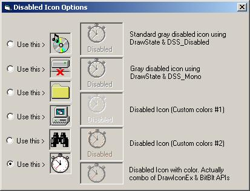

## FYI: Disabled Icon/Text Options

### Description

Just some examples/options of displaying disabled icons and or text. You are probably aware of most of these routines; but maybe not all... Enjoy; no feedback or voting requested. This project is too straightforward.
 
### More Info
 

             |
---                |---
**Submitted On**   |2003-10-29 13:33:02
**By**             |[LaVolpe](https://github.com/Planet-Source-Code/PSCIndex/blob/master/ByAuthor/lavolpe.md)
**Level**          |Advanced
**User Rating**    |5.0 (30 globes from 6 users)
**Compatibility**  |VB 5\.0, VB 6\.0
**Category**       |[Graphics](https://github.com/Planet-Source-Code/PSCIndex/blob/master/ByCategory/graphics__1-46.md)
**World**          |[Visual Basic](https://github.com/Planet-Source-Code/PSCIndex/blob/master/ByWorld/visual-basic.md)
**Archive File**   |[FYI\_\_Disab16645610292003\.zip](https://github.com/Planet-Source-Code/lavolpe-fyi-disabled-icon-text-options__1-49513/archive/master.zip)

